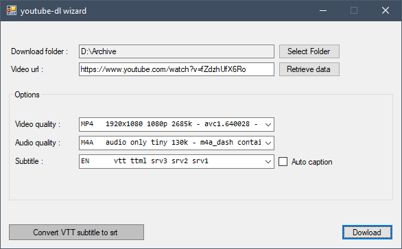

# youtube-dl.wizard
A  GUI wizard for [youtube-dl](https://github.com/ytdl-org/youtube-dl/blob/master/README.md) in windows, that helps you to download from youtube without struggling with command line complexities. 
## Screenshot

## Download link
- [Youtubedl.Wizard](https://github.com/BijaN-R/Youtubedl.Wizard/releases/latest)

## Installation
First of all you need to install `youtube-dl`. Download it from [here](https://yt-dl.org/latest/youtube-dl.exe) and place it in any System Environment path like `C:\Windows` (**BUT NOT IN** `C:\Windows\System32` , it won't work).  Then you can download `Youtubedl.Wizard.exe`  from [here](https://github.com/BijaN-R/Youtubedl.Wizard/releases/latest) , it will interact with youtube-dl for you.
## Description
This wizard doesn't work stand-alone, and it's just a shell for `youtube-dl`. It doesn't support all features of `youtube-dl`. 
This wizard only support this features: 

- Get list of available video and audio formats.
- Get list of subtitles.
- Download specific Video format.
- Download specific Audio format.
- Download Subtitle.
- Download Auto Caption Subtitles.
- Select a destination folder for download.
- And as an extra feature you can convert `vtt` subtitles to `srt` (this feature is not based on `youtube-dl`).

## Usage 
Run `Youtubedl.Wizard.exe` and paste your video url in `Video url` textbox. Click `Retrieve data` button to load video/audio and subtitle format lists. Then in `Options` area select any video, audio or subtitle you want and push download button to download them (check `Auto caption` checkbox to see auto generated subtitles). 

And also there is a `Convert vtt subtitle to srt` button that you can convert any vtt subtitle to srt by clicking on it.
